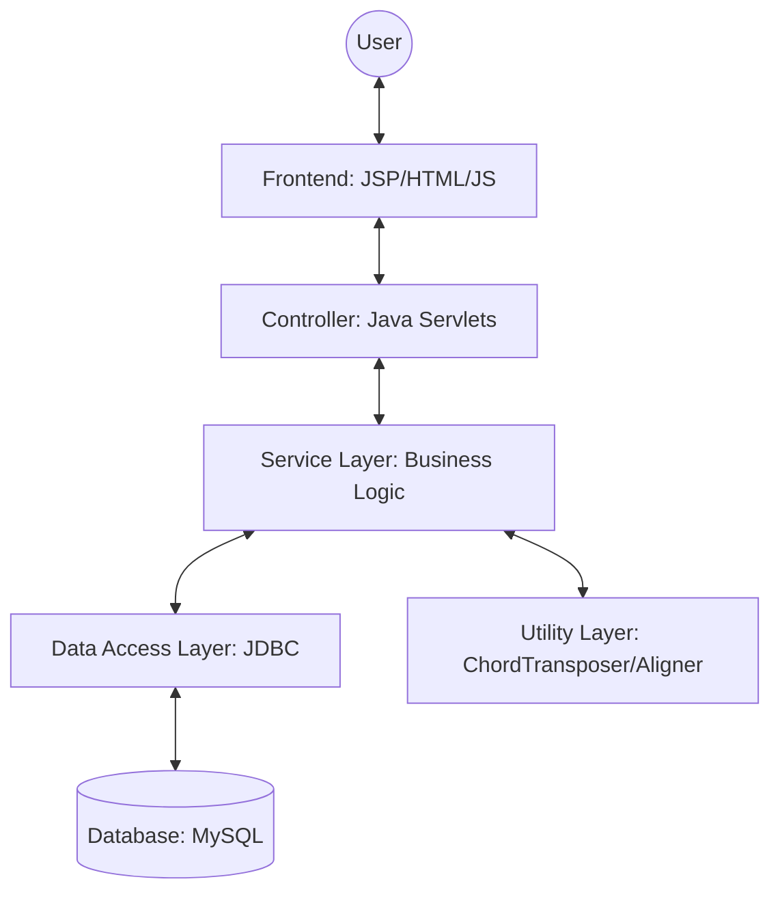

# Chapter 5: System Architecture

## 5.1 High-Level Architecture
The Worship Song Library follows a classic Three-Tier Architecture ensuring separation of concerns between the presentation, logic, and data layers.

## 5.2 Components Description

### 5.2.1 Presentation Layer (Frontend)
- JSP (JavaServer Pages): Used for server-side rendering of dynamic content.
- JavaScript: Handles client-side interactivity, such as the chord rendering engine and asynchronous search requests.
- CSS: Provides a responsive layout using modern techniques like Flexbox and CSS Grid.

### 5.2.2 Controller Layer (Servlets)
- SearchServlet: Routes search requests to the search service and handles pagination.
- SongViewServlet: Fetches full song data, handles transliteration settings, and applies session-based transposition.
- SetlistServlet: Manages song selections for a performance setlist.

### 5.2.3 Service Layer
- SearchService: Implements complex ranking and filtering logic across multiple languages.
- SongService: Orchestrates data retrieval from multiple DAOs to build a complete song object.
- TransliterationService: Uses ICU4J to convert text between scripts.

### 5.2.4 Data Access Layer (DAO)
- SongDAO: Handles CRUD operations for the main songs table.
- SetlistDAO: Manages the persistence of user-created setlists.
- HashtagDAO: Manages metadata associations for categorizing songs.

### 5.2.5 Utility Layer
- ChordTransposer: A mathematical utility that transposes chords based on the chromatic scale.
- ChordAligner: Aligns chord tokens to character indices in the lyrics.

## 5.3 User Roles
The system serves distinct user roles, each interacting with the architecture in specialized ways:
- Worship Leader: Focuses on discovery and organization. They heavily utilize the SearchService and SetlistDAO to compile repertoires for services.
- Musician: Focuses on performance. They interact primarily with the UI and Utility Layer, utilizing the `ChordTransposer` to shift keys and relying on the rendering engine for on-stage readability.
- Administrator: Focuses on data integrity. They interact with bulk import servlets and DAO layers to ingest new songs, correct typos, and assign metadata tags.

## 5.4 System Flow
1. Request: The user enters a search query.
2. Processing: The `SearchServlet` validates the query and delegates to the `SearchService`.
3. Data Retrieval: The `SearchService` calls `SongDAO` to fetch matching records from MySQL.
4. Ranking: The service applies weighting rules (Title > Artist > Lyrics) to sort the results.
5. Response: The results are returned as JSON and rendered in the UI.

## 5.5 Why this architecture?
This modular approach allows for independent testing of each component. For example, the `ChordTransposer` can be tested using JUnit without requiring a database connection or a running web server.

