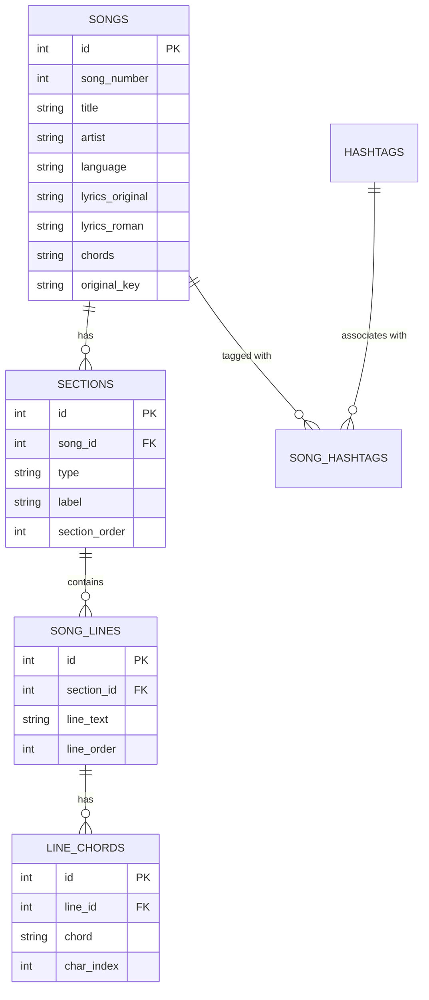

# Chapter 6: Database Design

## 6.1 Database Overview
The system uses a relational database model to store songs, their structure (sections and lines), and metadata. This design ensures data integrity and allows for efficient querying of complex relationships.

## 6.2 Entity Relationship Diagram (ERD)

## 6.3 Table Descriptions

### 6.1 `songs` Table
Stores the primary metadata for each song.
- `lyrics_original`: Stores text in the native script (Devanagari for Hindi/Marathi).
- `lyrics_roman`: Stores the transliterated version.
- `chords`: Stores the raw chord data (often in `[C]` format or two-line format).

### 6.2 `sections` Table
Songs are divided into sections like Verse, Chorus, and Bridge. This allows for structural navigation and conditional rendering.

### 6.3 `song_lines` Table
Stores each individual line of lyrics. By splitting songs into lines at the database level, the system can precisely anchor chords to specific lines.

### 6.4 `line_chords` Table
This is the most critical table for the rendering engine. It stores:
- `chord`: The musical chord symbol (e.g., "Gmaj7").
- `char_index`: The exact character position within the corresponding `song_line` where the chord should appear.

## 6.4 Normalization
The database is normalized to the Third Normal Form (3NF):
1. 1NF: All fields contain atomic values (e.g., chords are separated into individual rows in `line_chords`).
2. 2NF: All non-key attributes are fully dependent on the primary key.
3. 3NF: There are no transitive dependencies (e.g., hashtags are managed through a junction table `song_hashtags`).

## 6.5 Sample Records
| Table | id | title | language |
|---|---|---|---|
| songs | 45 | Aarati Ho | hindi |

| Table | id | song_id | type | label |
|---|---|---|---|
| sections | 101 | 45 | verse | Verse 1 |

| Table | id | line_text |
|---|---|---|
| song_lines | 501 | आरती हो आरती |

