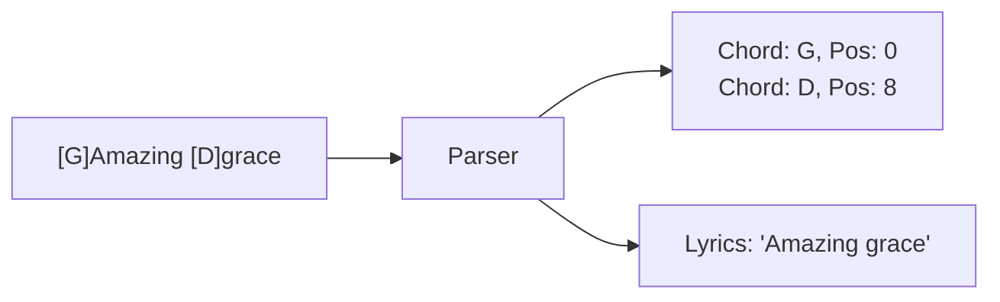

# Chapter 7: Chord System

## 7.1 The Challenge of Chord Alignment
In digital songbooks, the most common way to display chords is by placing them on a separate line above the lyrics, using spaces for alignment. However, this method is highly fragile:
- Font Variability: If the font is not monospaced, alignment breaks.
- Screen Resizing: When text wraps on mobile, the chord line and lyric line get out of sync.

## 7.2 The [C] Anchor Format
To solve this, the Worship Song Library uses an "Anchored Chord" format. Chords are embedded directly within the lyrics using brackets at the exact character position where they should be played.

Example Input:
`[G]Amazing [D]grace, how [Em]sweet the [C]sound`

Logic:
The parser scans the string, extracts the chord within `[]`, and records the character index of the next lyric character.

## 7.3 Chord Mapping Diagram
As shown in Figure 7.1 below, the parsing engine separates visual layout from logical data mapping.


Figure 7.1: The logical separation of chord positions from lyric strings during parsing.

## 7.4 Implementation: `formatChordedLine`
The following Java method (or its equivalent in the rendering utility) is responsible for converting the structured line data into an HTML representation where chords are absolute-positioned or line-synced.

```java
public String formatChordedLine(StructuredLine line) {
    StringBuilder html = new StringBuilder();
    html.append("<div class='song-line'>");
    
    // Logic to interleave chords and lyrics
    List<ChordOccurrence> chords = line.getChords();
    String lyrics = line.getLyrics();
    
    int lastIdx = 0;
    for (ChordOccurrence occ : chords) {
        // Add lyrics before this chord
        html.append(escapeHtml(lyrics.substring(lastIdx, occ.getPosition())));
        
        // Add chord with a wrapper for styling
        html.append("<span class='chord-wrap'>");
        html.append("<span class='chord-symbol'>").append(occ.getChord()).append("</span>");
        html.append("</span>");
        
        lastIdx = occ.getPosition();
    }
    // Add remaining lyrics
    html.append(escapeHtml(lyrics.substring(lastIdx)));
    
    html.append("</div>");
    return html.toString();
}
```

## 7.5 Real-Time Transposition
The system allows musicians to change the key of a song instantly. This is handled by a chromatic scale mapping:
`C -> C# -> D -> D# -> E -> F -> F# -> G -> G# -> A -> A# -> B`

When a user transposes by +2 semitones, every chord in the `line_chords` table is mapped forward by two steps in the scale.

<div align="center">
  
</div>
Figure 7.2: This screenshot demonstrates the successful alignment of musical chords over Devanagari script lyrics.

## 7.7 Edge Cases and Limitations
- Empty Chords: Lines with only chords and no lyrics (Intros/Outros).
- Overlapping Chords: Handled by a collision detection logic in the CSS.
- Unicode Width: Hindi characters often take more horizontal space than Latin characters; the rendering engine uses a character-index-to-pixel mapping to compensate.
- Limitation (Editing Complexity): If a typo is corrected in the lyric string (e.g., adding a missed letter), the character indices of all subsequent chords on that line must be manually or programmatically shifted to remain in sync.

