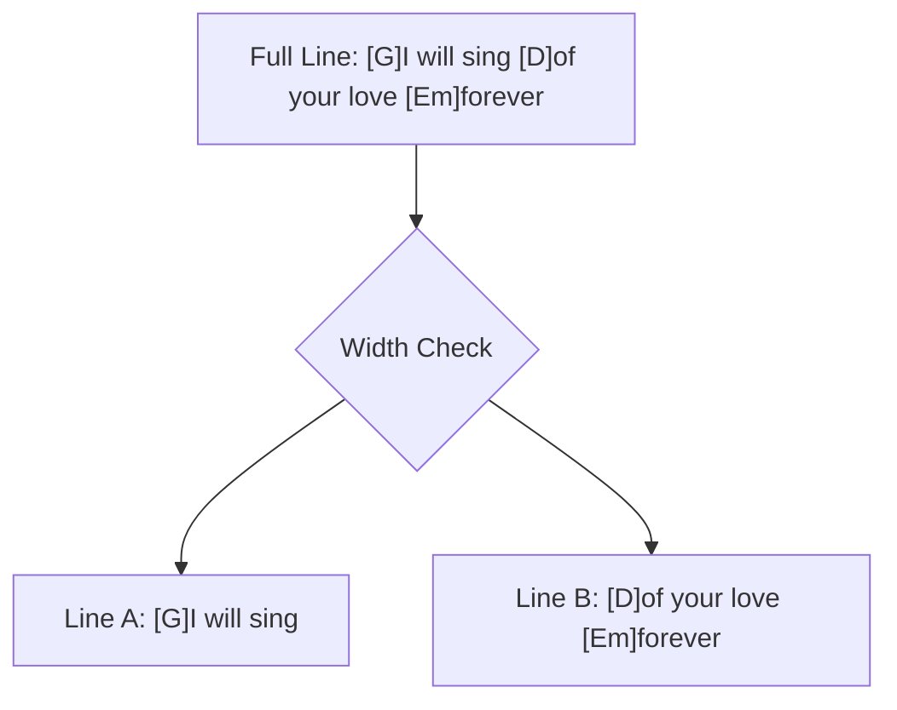

# Chapter 8: Rendering Engine

## 8.1 The Mobile Responsibility Problem
Standard songbook applications break on mobile because they assume a minimum screen width. When a long lyric line wraps, the chord line above it stays as a single line, causing the chords for the second half of the sentence to disappear or align incorrectly.

## 8.2 The Splitting Algorithm
The Worship Song Library implements a Virtual Wrapping Algorithm. Instead of letting the browser wrap the text naturally, the rendering engine:
1. Calculates the available width of the container.
2. Identifies where a line must split.
3. Recalculates the positions of all chords relative to the new split line.

### 8.2.1 Rendering Split Diagram
As shown in Figure 8.1, the algorithm breaks down long strings while keeping chord data associated with the correct substring.


Figure 8.1: The Virtual Wrapping Algorithm splitting logic.

## 8.3 Position Calculation (JavaScript)
The following snippet from `chord_splitting.js` shows the core logic for distributing chords into split line segments.

```javascript
function splitLine(lyrics, chords, maxWidth) {
    let segments = [];
    let currentPos = 0;
    
    while (currentPos < lyrics.length) {
        let chunk = lyrics.substring(currentPos, currentPos + charsPerLine);
        let segmentChords = chords.filter(c => c.position >= currentPos && c.position < currentPos + chunk.length);
        
        // Adjust positions to be relative to the start of the chunk
        segmentChords.forEach(c => c.relativePos = c.position - currentPos);
        
        segments.push({ text: chunk, chords: segmentChords });
        currentPos += chunk.length;
    }
    return segments;
}
```

## 8.4 Multi-Script Support
Rendering Devanagari (Hindi/Marathi) alongside chords presents a unique challenge because of "Matras" (vowel markers). The rendering engine treats a base character and its associated Matra as a single visual unit to maintain alignment.

## 8.5 Visual Comparison: Script Toggling
Users can toggle between the original script and Roman transliteration. This is handled by replacing the `lyrics` property while keeping the `chords` array constant.

<div align="center">
  
</div>
Figure 8.2: The same song from Figure 7.2, but toggled to Roman script. Note that chords remain in the exact same musical positions.

## 8.6 Performance Considerations
To ensure 60FPS scrolling even with hundreds of chords, the rendering engine:
- Uses GPU-accelerated CSS transforms for transposition animations.
- Implements Virtual Scrolling (loading only visible lines).
- Minimizes DOM thrashing by using document fragments during initial load.

## 8.7 Limitations
- Limitation (DOM Complexity): The Virtual Wrapping Algorithm requires extensive client-side calculation. Rapidly resizing the browser window on low-end mobile devices can cause temporary layout thrashing while the JavaScript engine recalculates positions.

