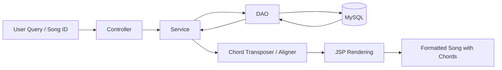
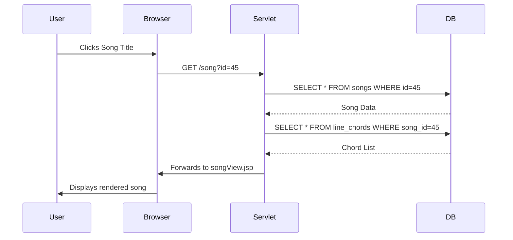

# Chapter 10: Implementation Flow

## 10.1 Data Flow Diagram (DFD)
As shown in the data flow diagram below, the system illustrates the flow of data from user input to the final rendered output.



## 10.2 Data Access Layer Implementation
The `SongDAO` class is the bridge between the Java application and the MySQL database. It uses prepared statements to ensure security against SQL injection.

DAO Query Example:
```java
public Song getSongById(int id) {
    String sql = "SELECT * FROM songs WHERE id = ? AND is_active = TRUE";
    try (Connection conn = DBConnection.getConnection();
         PreparedStatement ps = conn.prepareStatement(sql)) {
        
        ps.setInt(1, id);
        try (ResultSet rs = ps.executeQuery()) {
            if (rs.next()) {
                return mapResultSetToSong(rs);
            }
        }
    } catch (SQLException e) {
        e.printStackTrace();
    }
    return null;
}
```

## 10.3 System UI Flow
The application is designed as a Single Page Application (SPA) - style experience where possible, using AJAX for search and transposition.

1. Discovery: User finds a song via the home search.
2. Navigation: User clicks a song title.
3. Interactivity: User transposes the key or switches the script.
4. Action: User adds the song to a setlist for performance.

## 10.4 Sequence Diagram: Viewing a Song
As shown in the sequence diagram below, the application coordinates between the browser, servlet, and database to serve a requested song.


## 10.5 Deployment and Environment
The system is packaged as a WAR (Web ARchive) file and deployed on an Apache Tomcat 10 server. It utilizes:
- Connection Pooling: Via HikariCP for high-performance database access.
- Session Management: To store user preferences like preferred script and transposition offsets.
- Character Encoding Filter: To ensure perfect rendering of UTF-8 Devanagari characters.

## 10.6 Security and Error Handling
The application implements strict security protocols at the data and routing layers:
- SQL Injection Prevention: All database queries utilize parameterized `PreparedStatement` objects, mathematically preventing malicious input from being executed as SQL commands.
- Input Validation: The Servlet layer strictly parses integers (e.g., `songId`) and strips HTML from text inputs to mitigate Cross-Site Scripting (XSS).
- Session Handling: User preferences (like script toggles or setlist transpositions) are securely stored in server-side HTTP Sessions rather than easily manipulatable client-side cookies.

Robust error handling is implemented alongside security:
- DAO: Catches SQL exceptions and logs them without exposing stack traces to the user.
- Service: Validates business rules (e.g., ensuring transposition is within range).
- UI: Displays friendly error messages for "Song Not Found" or "Network Error".

